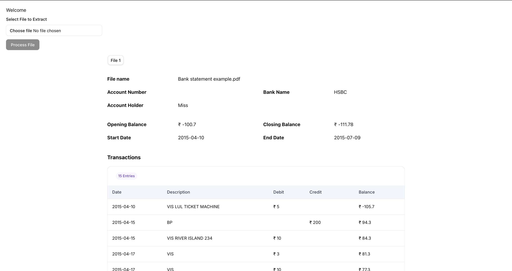

<h1 align="center">Xtract — Frontend</h1>

<p align="center">
  A Next.js web app for uploading bank-statement PDFs and viewing the extracted accounts, balances, and transactions in a clean, tabular interface.
</p>

<p align="center">
  
</p>

---

## Overview

Xtract is the web interface for the bank-statement extraction platform. A user uploads a PDF, the app sends it to the [backend](../Nest-Backend-PDF-Extractor) for OCR + AI processing, polls for the result, and renders the structured data — account metadata, opening/closing balances, and a sortable transaction table — with one tab per statement.

## Tech Stack

- **Next.js** 16.1.1 (App Router)
- **React** 19.2.3
- **Tailwind CSS** 4 (via `@tailwindcss/postcss`)
- **shadcn/ui** + **Radix UI** primitives (dropdown, label, select, slot, tabs)
- **TanStack React Table** 8 — sortable, paginated data table
- **Axios** — HTTP client
- **react-hot-toast** — toast notifications
- **lucide-react** — icons
- **TypeScript** 5, **pnpm** 10.28.2

## Features

- **PDF upload** with a live status indicator and success/error toasts.
- **Automatic polling** — after upload the app polls the backend every ~2 seconds until the job completes.
- **Tabbed results** — one tab per extracted statement, showing account number, bank name, account holder, statement date range, and opening/closing balances (₹).
- **Transaction table** — Date, Description, Debit, Credit, and Running Balance columns with pagination and column-visibility toggles.

## User Flow

1. Select a PDF and click **Process File**.
2. The app uploads it via `POST /upload` and receives a `jobId`.
3. It polls `GET /:jobId` every ~2 seconds.
4. On `COMPLETED`, the extracted statements render in the tabbed interface.

## Backend Connection

The app talks to the backend over HTTP (Axios). Configure the base URL via an environment variable:

| Variable                        | Purpose                                                      |
| ------------------------------- | ----------------------------------------------------------- |
| `NEXT_PUBLIC_BACKEND_BASE_URL`  | Backend API base URL, **with a trailing slash** (e.g. `http://localhost:3001/`) |

Endpoints used:

- `POST {NEXT_PUBLIC_BACKEND_BASE_URL}upload` — upload the PDF, returns `jobId`.
- `GET  {NEXT_PUBLIC_BACKEND_BASE_URL}{jobId}` — poll for status and results.

## Getting Started

### Prerequisites

- Node.js 20+
- pnpm 10.28.2
- The [Xtract backend](../Nest-Backend-PDF-Extractor) running and reachable

### Setup

Create a `.env.local` file:

```bash
NEXT_PUBLIC_BACKEND_BASE_URL=http://localhost:3001/
```

Install dependencies and start the dev server:

```bash
pnpm install
pnpm dev
```

Open [http://localhost:3000](http://localhost:3000).

### Production

```bash
pnpm build
pnpm start
```

### Docker

```bash
docker build -t xtract-frontend \
  --build-arg NEXT_PUBLIC_API_URL=http://localhost:3001/ .
docker run -p 3000:3000 xtract-frontend
```

The `NEXT_PUBLIC_BACKEND_BASE_URL` is a build-time value; set it via the `NEXT_PUBLIC_API_URL` build arg. Default port: **3000**.

## Project Structure

```
Xtract/
├── app/
│   ├── layout.tsx            # Root layout + Toaster
│   ├── page.tsx              # Home page (upload + results state)
│   └── globals.css
├── components/
│   ├── ui/                   # shadcn/ui primitives
│   ├── common/               # Reusable data-table components
│   ├── input-file.tsx        # PDF upload form + polling logic
│   ├── bankStatement.tsx     # Tabbed results display
│   └── expense-column.tsx    # Transaction table columns
├── lib/utils.ts
├── types/response.ts         # API response & data types
├── styles/fonts.ts
├── public/                   # Static assets
├── Dockerfile
└── next.config.ts
```

## CI/CD

A GitHub Actions workflow (`.github/workflows/workflow.yml`) triggers on push to the main branch: it builds the Next.js app, builds and pushes a Docker image, and deploys to the VM over SSH.
